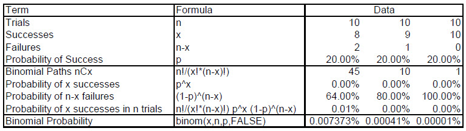

```{r setup, include=FALSE}
knitr::opts_chunk$set(echo = FALSE, warning=FALSE, message=FALSE)
knitr::opts_chunk$set(tidy = TRUE)
knitr::opts_chunk$set(tidy.opts=list(width.cutoff=36))
knitr::opts_chunk$set(size = "small")
knitr::opts_hooks$set(fig.width = function(options) {
  if (options$fig.width < options$fig.height) {
    options$fig.width = options$fig.height
  }
  options
})
knitr::knit_hooks$set(mysize = function(before, options, envir) {
  if (before) 
    return(options$size)
})

library(tidyverse)
library(tidyquant)
library(visNetwork)
library(DiagrammeR)
```

<script>
function showText(y) {
    var x = document.getElementById(y);
    if (x.style.display === "none") {
        x.style.display = "block";
    } else {
        x.style.display = "none";
    }
}
</script>


## What is a probability distribution?

For a given variable (e.g., house prices), the frequency of ranges of this variable (i.e., classes, groups, intervals).

### Discrete or continuous?

- Discrete: the number of distinct events (integers)

- Continuous: always possible to find a number between any two events (real number)

### Examples of distributions

1. The **Bernoulli** distribution is used in situations where an uncertain parameter can take on one of only two possible values. 
2. The **binomial** distribution is used for the number of outcomes on repeated trials when each trial is independently sampled (with replacement).
3. The **hypergeometric** distribution is used for the number of outcomes on repeated trials when each trial is dependent on another trial (without replacement).
4. The **poisson** distribution is used for the number of outcomes in a unit of time.
5. The **uniform** distribution describes an outcome that is equally likely to fall anywhere between a minimum and a maximum value.
6. The **triangular** distribution is a more flexible family of continuous distributions: these distributions are specified by three parameters: the minimum, maximum, and most likely values. 
7. The **normal** distribution is a symmetric distribution, usually specified by its mean and standard deviation.
8. The **exponential** distribution describes the frequency of times elapsed between random poisson occurrences.


# Imagine this

You are considering to found an equity fund to track risky investments in privately owned organizations

- You have a history of stock prices
- You know that today's stock price is the present value of stockholders' free cashflow for the foreseeable and not-so-foreseeable future
- You need a back of the envelope way to describe how stock prices and value evolve
- You also want to use this evolution to understand how a claim contingent on stock prices also evolves
- And the present value of such a claim

What do you want to know?

- Is there a distribution you can use to describe the evolution and also price a claim on the stock prices?

Why?

- So you can acquire or divest an asset, a project, or anything that generates cash flows over time and has the same risk profile as the stock price.

#  What's a binomial?

Suppose we know that the current stock price of Ross Stores (NASDQ: ROST) $S$ is \$109 per share. We might consider a simple forecast of the uncertain level of the asset's value in one day, or even several days into the future: it might go up or it might go down. That's a **binomial**.

We picture the binomial view of an anticipated stock price $S$ as branches from a root of $S_0=\$109$ per share today at time $t=0$. How can we forecast asset value at the end of one day $S_1$? We can do so by supposing that the stock price might simply rise or fall. Both up $u$ and down $d$ stock price outcomes, $S_{1,u}$ and $S_{1,d}$, might occur in $t=1$ day.

We might also want to represent our optimisim or pessimism about how often up moves and down moves might occur. Let's assume just for a minute that we are optimistic about the future so that the probability of any up move in this stock is $p = 0.60$. If the probability of an up move is 0.60, then the probability of a down move must be

<br>
<button onclick="showText('myDIV1')">show / hide</button>
<div id="myDIV1" style="display:none;"><br>

Probability of a down movement is 1 minue the probability of an up movement or $1-p=1-0.06=0.40$.

</div>
<br>

We can hover over the diagram below and locate the initial stock price and the up and down possibilities as well as probabilities of an up or down movement.

```{r branch1}
nodes <- data.frame(
  id = 1:3,
  title = c("S(0)=109", "S(1,u)", "S(1,d)")
)

edges <- data.frame(
  from = c(1),
  to = c(2,3),
  label = c("p=0.60", "1-p=1-0.60=0.40")
)

visNetwork(nodes, edges, width = "100%") %>% 
  visEdges(arrows = "to") %>% 
  visHierarchicalLayout(direction = "LR")
```

Now we can suppose that the stock price grows or declines by an amount. That amount can be learned from the sample standard deviation $\sigma$ of the rate of return of the stock price. Rates of return are just growth (or decline) rates. So that the one day ahead stock price will go up to

$$
S_{1,u} = S_0 + S_0 \sigma = S_0(1+\sigma) \approx S_0 e^{\sigma}
$$
Where we use the approximmation $(1+\sigma) \approx e^{\sigma}$. We must keep in mind that this is the one day standard deviation.

Let's get this a little more down to earth. We find that over the past 251 trading days that the stock return daily standard deviation is 0.0165 or 1.65\% per day. If we multiply this by 251 days a \$1 invested today would grow into `r exp(0.0165 * 251)`. This means that after 251 up jumps from today we would get this amount. Intuitively we might feel this is not very likely! Anyway, after just one up jump (a stock price move for one day) and if today's stock price is \$109 per share, then

$$
S_{1,u} = S_0 + S_0 \sigma = S_0(1+\sigma) \approx S_0 e^{\sigma} = 109 e^{0.0165} = `r 109 * exp(0.0165)`
$$

What goes up might just as well go down. If stock returns have a positive $\sigma = 0.0165$, and since $\sigma = var^{1/2}$, then it is possible for a negative or down turn in the return. Now the factor is $e^{-0.0165}=`r exp(-0.0165)`, a discount to the current stock price of \$109 per share.

$$
S_{1,d} = S_0 - S_0 \sigma = S_0(1-\sigma) \approx S_0 e^{-\sigma} = 109 e^{-0.0165} = `r 109 * exp(-0.0165)`
$$

If the stock could jump up 251 times it might decline that many times too. In that scenario, the stock price would move from \$109 to what level?

<br>
<button onclick="showText('myDIV2')">show / hide</button>
<div id="myDIV2" style="display:none;"><br>

`r 109*exp(-0.0165*251)`

What a decline!

</div>
<br>

What would be the expected value of the stock price in one day? This question is just a weighted average of the probabilities of up and down with the stock price outcomes, a random variable in one day.

<br>
<button onclick="showText('myDIV3')">show / hide</button>
<div id="myDIV3" style="display:none;"><br>

$$
E(S_1) = p S_{1,u} + (1-p) S_{1,d} = (0.60)(110.81)+(0.40)(107.2163)=109.37
$$

Just a tad above today's price.

</div>
<br>

## Then there were two

Yes, two draws of stock prices, one after the other, one conditional on the other. Let's look at this up and down tree.

```{r branch2}
# Create a node data frame
ndf <-
  create_node_df(
    n = 6,
    label = c("S(0)", "S(1,d)", "S(1,u)", "S(2,dd)", "S(2,ud=du)", "S(2,uu)"),
    type  = "lower",
    style = "filled",
    color = "orange",
    shape = c("circle", "circle", "circle", "circle", "circle", "circle"),
    data = c(109, 107,112,103,109,115)
  )
edf <-
  create_edge_df(
    from = c(1, 1, 2, 2, 3, 3),
    to   = c(2, 3, 4, 5, 5, 6),
    rel  = "leading_to"
  )
graph <-
  create_graph(
    nodes_df = ndf,
    edges_df = edf
  ) %>%
  add_global_graph_attrs(
    attr = "fontsize",
    value = 7,
    attr_type = "node"
  ) %>% 
  set_node_attrs(
    node_attr = "fontname",
    values = "Helvetica"
  ) %>%
  set_edge_attrs(
    edge_attr = "color",
    values = "blue"
  ) %>%
  set_edge_attrs(
    edge_attr = "arrowsize",
    values = 1
  )

graph %>% render_graph(layout = "tree")
```

SOme description is in order. At the top is right now, day 0. The second row is day 1. The third row is day 2. If the stock goes up from day 0 to day 1, then the value is $S(1,u)$. Similarly if the stock goes down. If after the stock goes up at day 1, then the stock can either go up to $S(2,uu)$ (that is, jump up twice) to go down to $S(2,ud)$ (that is, after jumping up it then jumps down). The same thoughts will occur when the stock goes down to $S(1,d)$.

How many paths are there to get to the third row where we have forecasted the 2nd day's stock price?

<br>
<button onclick="showText('myDIV4')">show / hide</button>
<div id="myDIV4" style="display:none;"><br>

For $S(2,uu)$ there is only one path, up and up.

For $S(2,ud=du)$ there are two paths, up and down, and down and up. It does not matter, they both lead to the same node.

For $S(2,dd)$ there is only one path, down and down.

</div>
<br>

### How often?

We can compute outcomes all day. But how often does a node occur? We remember that our task is to forecast stock prices in the future. To do that we realize that stock prices occur in a probable range. That means they are random variables, where the adjective **random** has the notion of an indiscriminate sampling of prices. But a random variable is not so colloquially indiscriminate as to not have a notion of a frequency of occurrence. The relative frequency, as we continue to see, is what we measure to be probability. Allowing probability into our lives also admits our beliefs into the analysis.

So what is the probability of a stock price after one up and one down jump?

<br>
<button onclick="showText('myDIV5')">show / hide</button>
<div id="myDIV5" style="display:none;"><br>

This is an example of a both-and event. Both an up and a down jump must occur. The probability of an up jump, according to our analysis is 0.60. The probabiilty of a down jump is then just $1-0.60=0.40$. Intuitively, if stock prices were to rise, that would account for 60\% of our experiments. Then after an up jump, the stock falls, so out of 60 pf a humdred experiments with stock prices, 40\% of those might occur.

Thus the probability of an up jump followed by a down jump is

$$
Prob(S(2, ud)) = p^1(1-p)^1 = (0.60)^1(0.40)^1 = 0.24
$$

THis is the probability of a single up and down combination.

Hang on! In the stock price tree we just admitted that there are two paths to get to a stock price that experiences both an up and a down jump. Okay, that would then mean there are two mutually exclusive ways of getting to an outcome like that. EIther the stock price jumps up then jumps down, or the stock price jumps down then up. This is thus an either-or event. We must therefore add the independently occurring probabilities.

$$
Prob(s(2, ud) \cup S(2, du)) = Prob(S(2, ud)) + Prob(S(2, du)) = 0.24 + 0.24 = 2(0.24) = 0.48
$$

Thus the complete answer is that 48\% of the time we might experience a stock price that jump up one day and down another.

</div>
<br>

How would we calculate the $S(2,du=ud)$ outcome?

<br>
<button onclick="showText('myDIV6')">show / hide</button>
<div id="myDIV6" style="display:none;"><br>

Let's use the up and down sequence. We already know that

$$
S_{1,u} = S_0 + S_0 \sigma = S_0(1+\sigma) \approx S_0 e^{\sigma} = 109 e^{0.0165} = `r 109 * exp(0.0165)`
$$

Yes, the stock price rises. After the rise to `r 109 * exp(0.0165)`, the stock price now jumps down. We take our up estimate and condition it with a down movement like this

$$
S_{2,ud} = S_{1,u} - S_{1.u} \sigma = S_{1,u}(1-\sigma) \approx S_{1,u} e^{-\sigma} = `r 109 * exp(0.0165)` e^{-0.0165} = `r 109 * exp(0.0165)*exp(-0.0165)`
$$
Yes, right back where we started. Do we not observe a symmeterical outcome? Yes, indeed we do.

</div>
<br>

The $S(2, du=ud)$ outcome occurs 48\% of the time given our optimism in this market.

## Being binomial

### Consumer goods 'r' us

From a Consumer Food database. 

1. What proportion of the database households are in the Metro area? Use this as the value of $p$ in a binomial distribution.
2. If you were to randomly select 25 of these households, what is the probability that exactly 8 would be in the Metro area?
3. If you were to randomly select 12 of these households, what is the probability that 3 or fewer would be households in the Metro area? 

Just like the probability of an up swing in stock prices, the proportion of Metro area households is the probability of that up or success (yes we found Metro households!) brach of the binomial tree. We can go on to then answer qeustions 2 and 3. We will need to know how many paths it can take to get to an outcome, the probability of a single path as well. Armed with this knowledge we can answer questions just like these.

### What's a binomial?

Let's get more precise.

- Two possible event outcomes only in each run or scenario of a binomial process
- E.g., default/not-default, reject/accept, comply/not-comply events
- Let $x$ = comply, then $P(x)$ = probability of compliance and $1 - P(x)$ = probability of non-compliance.

We use three assumptions:

1. Each replication of the process is a **combination** of events that results in one of two possible outcomes (usually referred to as "success"" or "failure" events).
2. The probability of success is the same for each replication.
3. The replications are independent, meaning here that a success in one replication does not influence the probability of success in another.

## What's a combination?

Start with a set of choices or categories. Combinations are the complete set of different ways you can arrange the various subsets of choices or categories. 

### For a simple example 

- Start with the set of $A= \{1,2\}$, where "1" is "comply" and "2" is "don't comply." 
- You can form four subsets of this set: {}, {1}, {2}, and {1,2} (don't forget the _null_ or "do nothing" subset). These subsets are the **combinations** of set A.
- Order does not matter so that $\{1,2\}$ is the same as $\{2,1\}$

### We have to start with permutation first

A permutation does care about the order of the elements in a subset, much like the order of letter in a word. We will find that combinations are found from permutations.

### Start with $A = \{a,b,c,d,e\}$ letters in a text to your friend. 
- With 5 letters to choose from we can select the first letter in 
5 ways. 
- We now have 4 letters left, so the second letter can be 
chosen in 4 ways, 
- Then the third letter in 3 ways
- The fourth letter in 2 ways
- The fifth letter in 1 way or
\[
5! = 5 \times 4 \times 3 \times 2 \times 1 = 120
\]
ways to build a word of text (granted some of these might be code).

### Find the number of 3 letter words you can form from a list of 5 letters.

Using the same logic as above this is 
\[
5 \times 4 \times 3 = 60
\]
There are 120 possible words you can form from 5 letters. There are 60 possible 3 letter sequences. This is called a **permutation**. In symbols we have 5 _permute_ 3 or $_{5}P_{3}$. We notice that $5! = 5 \times 4 \times 3 \times 2 \times 1 = 5 \times 4 \times 3 \times 2!$. So all we need to do to get the 60 permutations is take 5! and divide by 2! to get 

\[
_{5}P_{3} = \frac{5!}{2!} = 60
\]

Generally we have for $n$ elements permuted $x$ at a time:

\[
_{n}P_{x} = \frac{n!}{(n-x)!}
\]

### What about combinations?

Now we don't care about the order of the letters. We seem to also know that 

- **Permutations** track with the order of elements, here, letters: {a,d,c} $\neq$ {d,c,a}
- **Combinations** don't worry about the order of elements: {a,d,c} = {d,c,a}
- Thus out of the 60 permutations we just counted, we have to keep only one in $3 \times 2 \times 1 = 3! = 6$ (1/6th) of the 60 Permutations or 10 combinations. We then have 6 times more permutations than we need to account for combinations.

## Combinations from permutations
For our 5 letters taken 3 at a time without regard to the order of letters, we have
\[
_{5}C_{3} = {5 \choose 3} = \frac{5!}{3! \, (5 - 3)!}
\]
and then we compute
\[
= \frac{5x4x3x2x1}{(3x2x1)(2x1)} = 10
\]
More generally, we have
\[
_{n}C_{x} = {n \choose x} = \frac{n!}{x! \, (n - x)!}
\]
and
\[
_{n}P_{x} = _{n}C_{x}x! = {n \choose x}x! = \frac{n!}{(n - x)!}
\]

### Try these: combinations and permutations

A risk management practice has 8 members. Teams of three are formed to work with client project teams and provide management, subject matter expertise and budget and scheduling control. The practice leader wants to know

1. How many different project teams ("teams") can be formed from the practice?
2. How many teams of 3 members can be formed from the practice if each team is to have a team manager, a project controller, and a subject matter expert?

<br>
<button onclick="showText('myDIV7')">show / hide</button>
<div id="myDIV7" style="display:none;"><br>

Let's get to it.

1. How many different project teams ("teams") can be formed from the practice?

We will find the number of _combinations_ of 8 members taken 3 at a time without regard for the order. Calculate
\[
_{8}C_{3} = {8 \choose 3} = \frac{8!}{3! \, (8 - 3)!}
\]
so that
\[
_{8}C_{3} = \frac{8x7x6x5x4x3x2x1}{(3x2x1)(5x4x3x2x1)} = \frac{336}{6} = 56
\]
potential combinations of practice members.

2. How many teams of 3 members can be formed from the practice if each team is to have a team manager, a project controller, and a subject matter expert?

The practice leader is now interested in finding the number of _permutations_ of 8 members taken 3 at a time, _when the order matters_. Calculate
\[
_{8}P_{3} = {8 \choose 3}3! = \frac{8!}{3! \, (8 - 3)!}3!
\]
so that
\[
= 56 \, (3x2x1) = 336
\]
potential permutations of practice members.

</div>
<br>

## So how do we use the binomial process?

Follow these steps:

1. How many times did we repeat the process (number of observations)? $n$.
2. How many successes (events we are tracking)? $x$
3. How often does a success occur (event we are tracking)? $p(X = x)$
4. How many $x$ successes (events) in $n$ replications (trials, observations)? The number of possible combinations of $x$ successes in $n$ replications is
\[
_{n}C_{x} = {n \choose x} = \frac{n!}{x! \, (n - x)!}
\]
The $x$ successes can occur anywhere among the $n$ trials (observations). There are $_{n}C_{x}$ different ways of distributing $x$ successes in a sequence of $n$ trials (observations).

5. What is the probability of a single scenario (combination = 1) of $x$ successes? $p^x$

6. What is the probability of a single scenario of $n-x$ failures? $(1-p)^{n-x}$

7. What is the probability of all combinations of $x$ successes in $n$ trials (using the Excel formula)?
\[
P(X = x \mid n, p) = {n \choose x}p^x (1-p)^{n-x}
\]
We can also use the $BINOM.DIST(x,n,p,FALSE)$ formula in Excel, where `FALSE` indicates that we calculate the probability mass function value (the relative frequency) and `TRUE` indicates that we calculate cumulative probability value (the cumulative relative frequency).

## Try this: binomial distribution

A environmental control specialist picks a sample of 10 sensors from a large shipment of sensors. Experience has shown that 1 in 5 sensors fail to work when installed. The specialist is scheduling her time for the week and wants to know

1. What is the probability that she will pick exactly 2 of the defective sensors?
2. What is the probability that she will pick no more than 2 of the defective sensors?

<br>
<button onclick="showText('myDIV8')">show / hide</button>
<div id="myDIV8" style="display:none;"><br>

Using (a bit slavishly) our protocol:

1. What is the probability that she will pick exactly 2 of the defective sensors?

Follow these steps:

1. How many times did we repeat the process (number of observations)? Here $10$ is the sample size.
2. How many successes (we are tracking "defective" sensors)? No more than $2$ defective sensors.
3. How often does a success ("defective" sensor) occur (event we are tracking)? $p = 1/5 = 0.20$.
4. How many $x$ successes (events) in $n$ replications (trials, observations)? The number of possible combinations of $2$ successes ("defective" sensors) in $10$ replications (sample size) is

\[
_{10}C_{2} = {10 \choose 2} = \frac{10 !}{2! \, (10 - 2)!} =  45
\]

The $2$ defective sensors can occur anywhere among the $10$ sampled sensors. There are $_{10}C_{2}$ different ways of distributing $2$ defective sensors in a sequence of $10$ sampled sensors (observations).

5. What is the probability of a single scenario (combination = 1) of $x$ successes? $(0.2)^2 = 0.04$.

6. What is the probability of a single scenario of $n-x$ failures? $(1-0.2)^{10-2} = (0.8)^8 = 0.1678$

7. What is the probability of all combinations of $2$ defective sensors in a sample of $10$ sensors?
\[
Binom(10,2,0.2) = {10 \choose 2}(0.2)^2 (1-0.2)^{10-2}
\]
or
\[
Binom(10,2,0.2) = (45)(0.04)(0.1678) = 0.3020
\]
and in Excel `BINOM.DIST(2,10,0.2,FALSE)`.

2. What is the probability that she will pick no more than 2 of the defective sensors?

Assuming no intersections and independent sampling of the 10 sensors,the probability is the union of three events, finding 0, 1, and 2 defective sensors. We have
\[
P(X \leq 2) = P(X = 0) + P(X = 1) + P(X = 2)
\]
We already have $P(X = 2) = 0.3020$. Now we calculate

\[
P(X = 0) = Binom(10,0,0.2) = {10 \choose 0}(0.2)^0 (1-0.2)^{10-0}
\]
or
\[
Binom(10,0,0.2) = 0.1074
\]
Similarly,$P(X = 1) = 0.2684$. We have then
\[
P(X \leq 2) = P(X = 0) + P(X = 1) + P(X = 2) = 0.6778
\]

</div>
<br>

### Try another

Using the same sensor problem, what is the probability that she will pick 8 or more defective sensors? What if she picks more than 8 defective sensors?

- Build a simple spreadsheet table to answer these questions.

<br>
<button onclick="showText('myDIV9')">show / hide</button>
<div id="myDIV9" style="display:none;"><br>

Assuming no intersections and independent sampling of the 10 sensors,the probability is the union of three events, finding 8, 9, and 10 defective sensors. We have, if she finds 8 or more defective sensors,
\[
P(X \geq 8) = P(\{X=8\}\cup \{X=9\} \cup \{X=10\})
\]
and with mutually exclusive, independent (with replacement) events,
\[
P(\{X=8\}\cup \{X=9\} \cup \{X=10\}) 
\]
\[
= P(X = 8) + P(X = 9) + P(X = 10) = 0.0078\%
\]
Finding more than 8 sensors
\[
P(X > 8) = P(\{X=9\} \cup \{X=10\})
\]
and with mutually exclusive, independent (with replacement) events,
\[
P(\{X=9\} \cup \{X=10\}) = P(X = 9) + P(X = 10) = 0.00042\%
\]

Here is a worksheet table that builds up these calculations.


</div>
<br>

## What does a graph of the binomial look like?

```{r, echo = FALSE}
library(ggplot2)
library(plotly)
x <- 0:10
n <- max(x)
p <- c(0.2,0.5,0.8)
y <- tibble(low = dbinom(x, n, 0.20), medium = dbinom(x, n, 0.5), high = dbinom(x, n, 0.80))
plt <- ggplot(y, aes(x = x, y = y$low)) +
  geom_line() +
  geom_line(aes(x = x, y = y$medium), color = "red") +
  geom_line(aes(x = x, y = y$high), color = "blue") +
  ggtitle("Binomial highs and loss")
ggplotly(plt)
```

## Binomial statistics

Here we need just the mean and standard deviation.

- Mean of a binomial distribution
\[
\mu = n p
\]
- Standard deviation of a binomial distribution
\[
\sigma = (n p (1-p))^{1/2}
\]

### Try this

Use the data from the last example above. What are the mean and standard deviation of the sensor problem?

<br>
<button onclick="showText('myDIV10')">show / hide</button>
<div id="myDIV10" style="display:none;"><br>


We calculate for $n = 10$ and $p = 0.20$

Mean of the sensor binomial distribution
\[
\mu = n p = (10)(0.20) = 2
\]
defective sensors.

Standard deviation of the sensor binomial distribution
\[
\sigma = (n p (1-p))^{1/2} = ((10)(0.20)(0.80))
\]
1.26, or rounding down, 1 defective sensor.

</div>
<br>

## Short exercises

1. Hospital records show that of patients suffering from a certain rare disease, 75\% die of it. What is the probability that of 6 randomly selected patients, 4 will recover?

_Answer_: 3.3\%

2. For the patients suffering from a certain disease, What is the probability that all 6 randomly selected patients will recover?

_Answer_: very, very small

3. You are trying reach your surveying team in the iron rich creases of the Mesabi mountain range. there was a probability of 80\% of success in any attempt to connect by cell phone. What is the probability of having 7 successes in 10 attempts?

_Answer_: a little over 20\%

4. A manufacturer of metal pistons finds that, on the average, 12\% of the pistons are rejected by customers because they are either oversize or undersize. What is the probability that a batch of 10 pistons will contain no more than 2 rejects?

_Answer_: 89\%

## Binomial barrels

You own a small refinery. Inputs are barrels of crude products. Outputs are barrels of refined products. Your corporate policy is to allow shipments where no more than 3 sampled barrels of unacceptable quality (non-compliant) are discovered in a sample of 10 barrels. However, because of the nature of the production process and the quality of inputs, it is 20\% of time that bad barrels occur.

Use this [Excel workbook (binomial.xlsx)](xlsx/binomial.xlsx) to perform these tasks and answer the questions below:

1. Sample 30 barrels from the population.
2. Set up the spreadsheet model for probabilities (p) of a non-compliant barrel equal to 20%, 50%, and 80%.
3. What is the probability that 5 or fewer barrels will likely be found?
4. What is the probability that 15 or greater barrels will be found?
5. How probable is it that between 5 and 15 barrels will found exclusive of 5 or 15?
