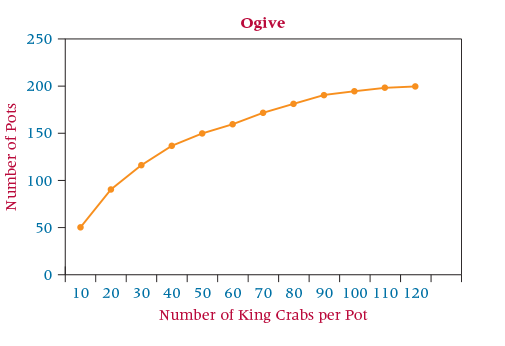

<style>
pre {
  font-family: 'Calibri';
  font-size: 11pt;
  white-space: pre;
  padding: 5px;    
  border: 2px solid blue;
  dispay: block;
}
}
</style>

```{r setup, include=FALSE}
knitr::opts_chunk$set(echo = FALSE, warning = FALSE, message = FALSE)

suppressPackageStartupMessages(library(knitr))
suppressPackageStartupMessages(library(kableExtra))
suppressPackageStartupMessages(library(bsselectR))
suppressPackageStartupMessages(library(ggplot2))
suppressPackageStartupMessages(library(tidyverse))
suppressPackageStartupMessages(library(stringr))


library(htmltools)

q_num <- 1
q_inc <- function(q_exp) {
  q_num <<- q_num + 1
  return(div(div(id=sprintf("q%d", q_num-1), 
                 style="display:none;font-family:'Calibri'", 
                 pre(deparse(substitute(q_exp)), q_exp)),
              HTML(sprintf('<button type="button" onclick="toggle(%d);" class="btn btn-success">show answer</button>',
                           q_num-1))))
}
```

<script>
  var toggle = function(i) {
  var mydiv = document.getElementById('q' + i);
  if (mydiv.style.display === 'block' || mydiv.style.display === '')
    mydiv.style.display = 'none';
  else
    mydiv.style.display = 'block'
  }
</script>
<br />

## Learning outcomes

1. Identify data types relevant to decision requirements

2. Construct data intervals

3. Count data in intervals

4. Transform count data into relative and vumulative relative frequency metrics

5. Interpret the results to meet business decision requirements

## A call center needs help

A call center is trying to better understand staffing requirements. It investigates the number of calls received during the evening shift and obtains the information given below.
<br />
Construct a histogram of the data and comment on the key characteristics of the distribution. 

```{r }
call_data <- read.csv("data/qq-freq-histogram-7.csv")
call_data %>%
  kable("html", escape = F) %>% 
    kable_styling(bootstrap_options = c("striped", "hover"), full_width = T)
```

```{r}
#calls <- sample(2:8, 78, prob = c(0.115384615, 0.08974359, 0.128205128, 0.076923077, 0.166666667, 0.192307692, 0.230769231), replace = TRUE)
calls <- c(rep(11, 9), rep(21, 7), rep(31, 10), rep(41, 6), rep(51, 13), rep(61, 18), rep(71, 15))
calls <- data.frame(calls = calls)
p_blank <- ggplot(calls, aes(x = calls))
ggsave("images/blank.png")
p_calls <- ggplot(calls, aes(x = calls)) + geom_histogram() + stat_bin(binwidth= 10, geom="text", aes(label=..count..), vjust = -1) + scale_x_continuous(breaks=seq(0,max(calls$calls), 10)) + ylim(0, 25)
ggsave("images/calls.png")

plots <- paste0(list.files("images", full.names = TRUE))
names(plots) <- str_replace_all(plots, 
                                      c("\\.png" = "", 
                                        "images/" = ""))

bsselect(plots, type = "img", selected = "blank", 
         live_search = TRUE, show_tick = TRUE)
```

Why might you use a frequency polygon and compare it to the histogram? Which do you prefer, and why?

```{r}
answers <- c("I like bars and really hate lines.", 
            "It illustrates a range of observations in a class interval.", 
            "But it can be misleading especially with discrete data.")

names(answers) <- c("Einstein", "Musa", "Alin")

bsselect(answers, type = "text", show_tick = TRUE)
```
<br />


## Strait investment

A hundred or so boats go fishing every year for three or four weeks off of the Bering Strait for Alaskan king crabs. To catch these king crabs, large pots are baited and left on the sea bottom, often several hundred feet deep. Because of the investment in boats, equipment, personnel, and supplies, fishing for such crabs can be financially risky if not enough crabs are caught. Thus, as pots are pulled and emptied, there is great interest in how many legal king crabs (males of a certain size) there are in any given pot. 

Suppose the number of legal king crabs is reported for each pot during a season and recorded. In addition, suppose that 200 of these are randomly selected and the numbers per pot are used to create the ogive shown below. 

Study the ogive curve and comment on the number of legal king crabs per pot.



<br />

```{r}
answers <- c("Es gibt keine Zufälle.", 
            "There's at least 150 pots with more than 50 King Crabs per pot.", 
            "But there's at most 50 King Crabs per pot in less than 150 pots.")

names(answers) <- c("Einstein", "Musa", "Alin")

bsselect(answers, type = "text", show_tick = TRUE)
```
<br />
