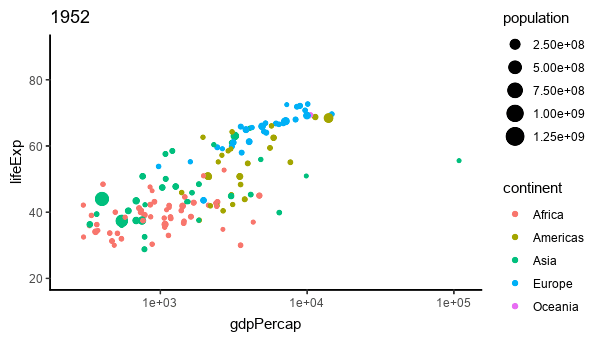

```{r setup, include=FALSE}
knitr::opts_chunk$set(echo = FALSE, warning = FALSE, message = FALSE)

suppressPackageStartupMessages(library(knitr))
suppressPackageStartupMessages(library(kableExtra))
suppressPackageStartupMessages(library(bsselectR))
suppressPackageStartupMessages(library(ggplot2))
suppressPackageStartupMessages(library(tidyverse))
suppressPackageStartupMessages(library(stringr))
```

<script>
function showText(y) {
    var x = document.getElementById(y);
    if (x.style.display === "none") {
        x.style.display = "block";
    } else {
        x.style.display = "none";
    }
}
</script>

## Learning outcomes

1. Develop useful decision making questions

2. Find data to help answer those questions

3. Produce an exploratory analysis of the data

4. Interpret results for a decision maker

5. Reflect on the analytical process

## Directions

In teams of 3-4 work through the following scenario.

- Each team member should think through the questions, view materials, and record ideas and pictures in the member's class notebook. 

- The team pulls together members' thoughts and ideas.

- The team formulates answers; each team member records a summary in the notebook.

- Teams present results of their discussions to one another; everyoone updates their notebooks with the results of the discussion.

- After class, each team records their summary of the class in the [team reflections blog at this site here](https://wfoote01-buan227s2019.blogspot.com).

## Imagine this...

Suppose your organization funds medical aid (including: money, personnel, expert advice, materials) to various countries and regions, especially impoverished areas due to famine, war, disease, and natural disasters. As part of the support for managers to allocation scarce funding from individuals and governments, you examine the characteristics of potential recipient countries.

- One criterion used by the World Bank is the relationship between life expectancy and gross domestic product per capita.

- The analysis would identify trends, deviations from trend, and outliers in the data. The data are for each of several countries across several years.

#### Who is the decision maker? 

<button onclick="showText('myDIV1')">show / hide</button>
<div id="myDIV1" style="display:none;">

Non-for-profit resource managers.

</div>

#### What is the decision?

<button onclick="showText('myDIV2')">show / hide</button>
<div id="myDIV2" style="display:none;">

Project funding choices by country and 

- Wealth status

- Health status

</div>

#### What is the data?

<button onclick="showText('myDIV3')">show / hide</button>
<div id="myDIV3" style="display:none;">

- Wealth: GDP

- Health: life expectancy

</div>

#### Watch this

```{r echo = FALSE, fig.height = 3, fig.width = 5, fig.align = "center", message = FALSE, warning = FALSE, include = FALSE}
#library(gapminder)
#library(ggplot2)
#library(magick)
#img <- image_graph(600, 400, res = 96)
#datalist <- split(gapminder, gapminder$year)
#out <- lapply(datalist, function(data){
 # p <- ggplot(data, aes(gdpPercap, lifeExp, size = pop, color = continent)) +
  #  scale_size("population", limits = range(gapminder$pop)) + geom_point() + ylim(20, 90) +
   # scale_x_log10(limits = range(gapminder$gdpPercap)) + ggtitle(data$year) + theme_classic()
  #print(p)
#})
#while (!is.null(dev.list()))  dev.off()
#img <- image_background(image_trim(img), 'white')
#animation <- image_animate(img, fps = 2)
#print(animation)
#image_write(animation, "gapminder.gif")
```



[Source: gapminder.org 1952-2007](https://www.gapminder.org/data/).

This animation is based on Hans Roslings' engaging discussion of [200 years, 200 countries](https://www.youtube.com/watch?v=jbkSRLYSojo).

#### Watch and question further

> Are Africa and Oceania stagnating while other regions improve?

> Is Europe always in the lead to better health and wealth?

> How fast is India and China catching up with Europe?

> How might the US (big Americas bubble) lead nearly all other regions?

> Are the rest of the Americas being left in the dust?

#### Are life expectancy and GDP per capita related? If so, what countries lag the others in health and wealth?

> Put differently: are health and wealth related?

> Can you develop a provisional list of potential recipient countries?

## What might we have learned from this process?

- Decisions made by managers raise critical questions for analysis

- Even a relatively simple set of data can provide insight

- Insight derives from breaking up (analyzing) the data and associating pieces of the data into parts relevant to the questions raised

- Decisions driven by data and analysis can validate hunches, correct bias, and provide a common basis for systematic discussion and decision making

- Everything ends up as data and pictures tell a story

- There is no one unique answer

## Team reflection

[You can access the team reflections blog at this site here](https://wfoote01-buan227s2019.blogspot.com)

Summarize what the team took away from this class as key learnings in the first entry titled **Welcome**.


