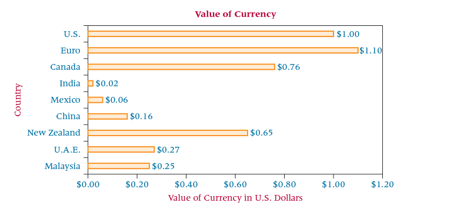

<style>
pre {
  font-family: 'Calibri';
  font-size: 11pt;
  white-space: pre;
  padding: 5px;    
  border: 2px solid blue;
  dispay: block;
}
}
</style>

```{r setup, include=FALSE}
knitr::opts_chunk$set(echo = FALSE, warning = FALSE, message = FALSE)

suppressPackageStartupMessages(library(knitr))
suppressPackageStartupMessages(library(kableExtra))
suppressPackageStartupMessages(library(bsselectR))
suppressPackageStartupMessages(library(ggplot2))
suppressPackageStartupMessages(library(tidyverse))
suppressPackageStartupMessages(library(stringr))


library(htmltools)

q_num <- 1
q_inc <- function(q_exp) {
  q_num <<- q_num + 1
  return(div(div(id=sprintf("q%d", q_num-1), 
                 style="display:none;font-family:'Calibri'", 
                 pre(deparse(substitute(q_exp)), q_exp)),
              HTML(sprintf('<button type="button" onclick="toggle(%d);" class="btn btn-success">show answer</button>',
                           q_num-1))))
}
```

<script>
  var toggle = function(i) {
  var mydiv = document.getElementById('q' + i);
  if (mydiv.style.display === 'block' || mydiv.style.display === '')
    mydiv.style.display = 'none';
  else
    mydiv.style.display = 'block'
  }
</script>
<br />

(2.15) Here is revenue data from the top 5 semiconductor companies.

```{r }
rev_data <- na.omit(read.csv("data/qq-barchart-15.csv"))
rev_data %>%
  kable("html", escape = F) %>% 
    kable_styling(bootstrap_options = c("striped", "hover"), full_width = T)
```

a. Construct a bar chart to display these data.
b. Construct a pie chart from these data and label the slices with the appropriate percentages.

```{r}
rev_data <- data.frame(firm = rev_data$Firm, rev = rev_data$Revenue)
plots_bar <- ggplot(rev_data, aes(x = firm, y = rev)) + geom_bar(width = 1, stat = "identity")
ggsave("images-2-15/bar-chart.png")
plots_pie <- pie(c(51, 19, 15, 12, 8), labels = c("Intel", "Qualcomm", "Micro+Elpida", "Texas Instruments", "Broadcom"))
ggsave("images-2-15/pie-chart.png")

plots <- paste0(list.files("images-2-15", full.names = TRUE))
names(plots) <- str_replace_all(plots, 
                                      c("\\.png" = "", 
                                        "images-2-15/" = ""))

bsselect(plots, type = "img", selected = "bar-chart", 
         live_search = TRUE, show_tick = TRUE)
```

c. Comment on the effectiveness of using a pie chart versus a bar chart to display the revenue of these five companies.

```{r}
answers <- c("I like bars and really hate pie.", 
            "Bar charts show truly compatible sizes for comparison.", 
            "Pie charts can be good for illustrating up to 3 components.")

names(answers) <- c("Einstein", "Musa", "Alin")

bsselect(answers, type = "text", show_tick = TRUE)
```

(2.18)
Comment on the chart below. How useful is it? Can you improve on it?



```{r}
answers <- c("Es gibt keine Zufälle.", 
            "The bar chart is the right idea, but it is still hard to interpret.", 
            "Perhaps we can order the values on the y-axis from highest to lowest.")

names(answers) <- c("Einstein", "Musa", "Alin")

bsselect(answers, type = "text", show_tick = TRUE)
```

[CHECK OUT THIS ANIMATED BAR CHART](https://turing.manhattan.edu/~wfoote01/bsnstat/QUIZ/Japan's%20ageing%20population,%20animated%20with%20R%20(Revolutions).html)