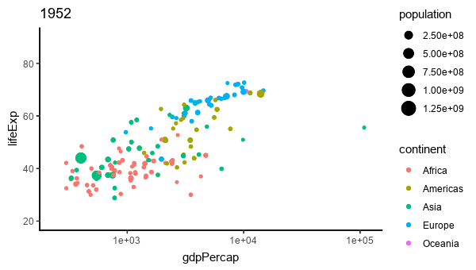

```{r setup, include=FALSE}
knitr::opts_chunk$set(echo = TRUE)
```

```{r gapminder, echo = FALSE, eval = FALSE, fig.height = 3, fig.width = 5, fig.align = "center", message = FALSE, warning = FALSE, include = FALSE}
library(gapminder)
library(ggplot2)
library(magick)
library(plotly)
img <- image_graph(1000, 600, res = 96)
datalist <- split(gapminder, gapminder$year)
out <- lapply(datalist, function(data){
  p <- ggplot(data, aes(gdpPercap, lifeExp, size = pop, color = continent)) +
    scale_size("population", limits = range(gapminder$pop)) + geom_point() + ylim(20, 90) +
    scale_x_log10(limits = range(gapminder$gdpPercap)) + ggtitle(data$year) + theme_classic()
  print(p)
})
while (!is.null(dev.list()))  dev.off()
img <- image_background(image_trim(img), 'white')
animation <- image_animate(img, fps = 2)
print(animation)
image_write(animation, "img/gapminder2.gif")
```



## Watch and question

> Are Africa and Oceania stagnating while other regions improve?

> Is Europe always in the lead to better health and wealth?

> How fast is India and China catching up with Europe?

> How might the US (big Americas bubble) lead nearly all other regions?

> Are the rest of the Americas being left in the dust?

Suppose your organization helps to prioritize aid to various countries and regions. As part of support for managers to allocation scarce funding from individuals and governments, you examine the characteristics of recipient countries.

- One criterion used by the World Bank is the relationship between life expectancy and gross domestic product per capita.

- The analysis would identify trends, deviations from trend, and outliers in the data. The data are for each of several countries across several years.

We use **statistical thinking** to support decision makers with evidenced-based conclusions that derive from answers to questions like those posed above.

[Source: gapminder.org 1952-2007](https://www.gapminder.org/data/).

This animation is based on Hans Roslings' engaging discussion of [200 years, 200 countries](https://www.youtube.com/watch?v=jbkSRLYSojo).